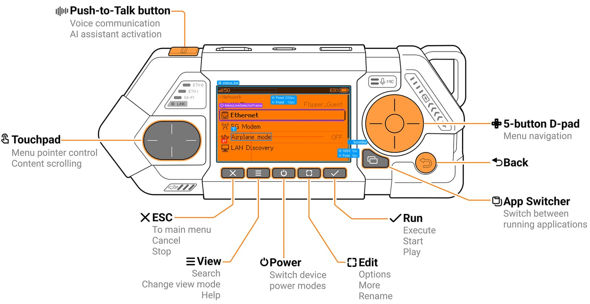
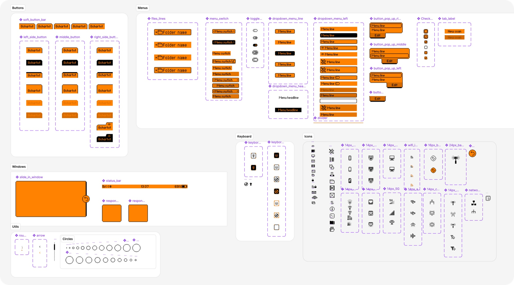
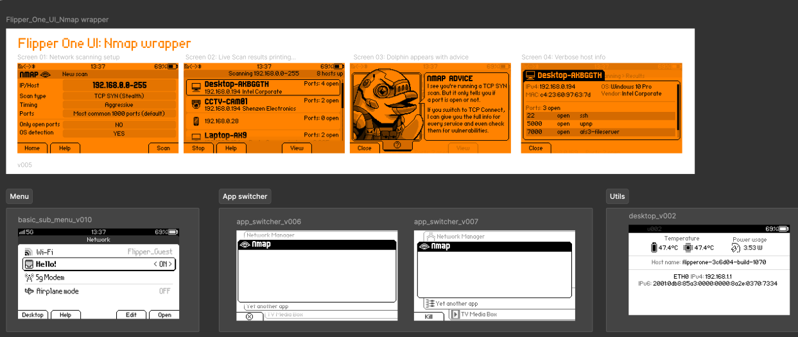
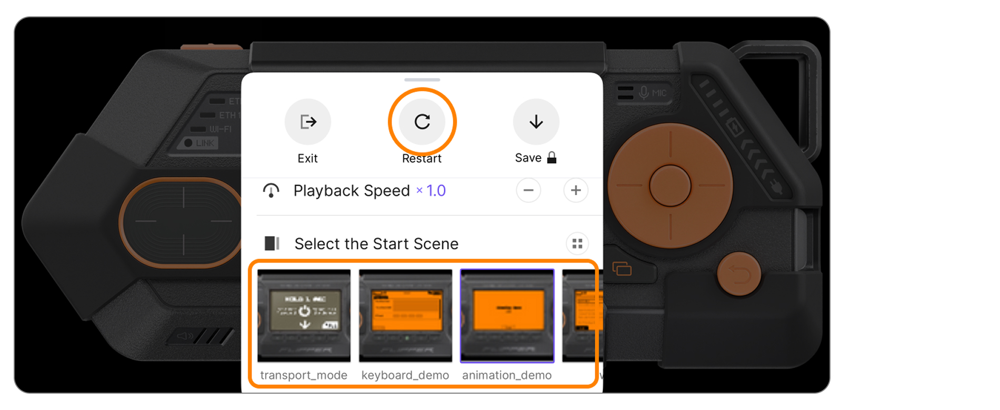
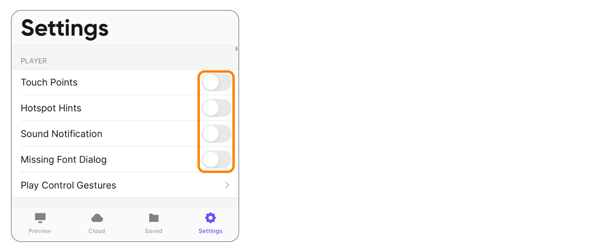

# Flipper One User Interface & Graphics

This repository is part of the [Flipper One — User Interface & Graphics](https://github.com/orgs/flipperdevices/projects/12) sub-project, which covers FlipCTL interface development, as well as design assets, illustrations, and source graphics files.

>For now, this repository hosts this README with an overview of the sub-project and its design resources.

## Links

- **Developer Portal:** [docs.flipper.net/one](https://docs.flipper.net/one)
- [**Sub-project overview**](https://docs.flipper.net/one/user-interface/about)
- [**Task tracker**](https://github.com/orgs/flipperdevices/projects/12)
- [**Assets library in Figma**](https://www.figma.com/design/U4k0qHkl9JdCu17MEtLFdI/Flipper-One-UI-Assets-library?node-id=0-1&t=zfmlKGksE4iBQ57H-1)
- [**Main board in Figma**](https://www.figma.com/design/PhlEqdtgjFfcizdVV0qNSR/Flipper-One-UI---Main-board?node-id=368-270&t=YcLCv1SFsc4TCTiV-1)
- [**UI demo in ProtoPie**](https://cloud.protopie.io/p/8b3ce95e854c87471d14d3a0)

## How to contribute

The User Interface sub-project accepts contributions through comments on open tasks. Anyone can submit design proposals as comments on tasks with the **help wanted** label.

1. Read [How to contribute](https://docs.flipper.net/one/user-interface/about#how-to-contribute).
2. Browse the [Task tracker](https://github.com/orgs/flipperdevices/projects/12) and pick a task labeled **help wanted**.
3. Create your design using the [Asset library](https://www.figma.com/design/U4k0qHkl9JdCu17MEtLFdI/Flipper-One-UI-Assets-library?node-id=0-1&t=zfmlKGksE4iBQ57H-1).
4. Set your Figma board to **Anyone can view**.
5. Enable **Viewers can copy, save, and export**.
6. Comment on the task with a detailed description, a screenshot, and a link to your Figma source file.

## Assets library in Figma
The [Assets library](https://www.figma.com/design/U4k0qHkl9JdCu17MEtLFdI/Flipper-One-UI-Assets-library?node-id=0-1&t=zfmlKGksE4iBQ57H-1) hosts the components used to build Flipper One's user interface. You can browse the library in your browser without a paid Figma plan.

>If you have a paid Figma plan, you can add the assets to your libraries. Check the [official Figma guide](https://help.figma.com/hc/en-us/articles/360041051154-Guide-to-libraries-in-Figma).

The library has two pages:

- **UI - Prototype Assets:** components for mockups and hypothesis testing inside Figma. Uses orange and black screen-like colors that mimic the Flipper One display.
- **UI - Dev ready:** components for building UI that will be shipped to the Flipper One screen.

## Main board in Figma

The [Main board](https://www.figma.com/design/PhlEqdtgjFfcizdVV0qNSR/Flipper-One-UI---Main-board?node-id=368-270&t=YcLCv1SFsc4TCTiV-1) hosts interface development, design assets, illustrations, and source graphics files.

The board has three pages:

- **Documentation:** illustrations and technical drawings.
- **UI OUT:** development-ready, assembled UI layouts.
- **UI Live Preview:** pre-assembled UI layouts for look-and-feel tests on the device.

## UI demo in ProtoPie (Deprecated)

[ProtoPie](https://www.protopie.io/) is a prototyping tool for building interactive prototypes of apps and devices. We relied on it before we could prototype directly on the Flipper One screen. While it's now deprecated for our workflow, you can still run the interactive Flipper One interface. ProtoPie works best via the mobile app, but it can also run in a browser without installing the app.

### Launch the ProtoPie demo on your phone

1. Install **ProtoPie Player** on your [Android](https://play.google.com/store/apps/details?id=io.protopie.companion&hl=en&pli=1) or [iOS](https://apps.apple.com/us/app/protopie-player/id1015837511) phone.

2. Open the link on your phone:
   https://cloud.protopie.io/p/8b3ce95e854c87471d14d3a0
   
   or
   
   Scan the QR code using the **ProtoPie Player** app:

    

    
    

### ProtoPie settings tips

In ProtoPie Player, double-tap with two fingers to access the menu, where you can:

- Tap **Restart** if ProtoPie Player freezes.
- Switch between different scenes.

In **Settings**, you can disable touch highlights and purple hint overlays to prevent them from interfering with the UI preview.

